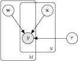

User's guide
============

* Construct the model (Bayesian network)

* Put the data in

* Run inference

* Examine posterior results

Simple example
--------------

.. Use this .* suffix to enable .pdf for PDF and .png for HTML
   image:: images/model01.*
   BUT, readthedocs.org has a bug, so I must use .png until this issue is closed:
   https://github.com/rtfd/readthedocs.org/issues/183
   So, until then, I must use PNG images also in PDF files.. That just sucks.

   Or even better would be if I could use the TikZ images directly
   here with the help of tikz.py. Then all the text would be "native"
   in LaTeX->PDF. However, tikz.py doesn't work for HTML output in
   readthedocs.org because of some missing applications.

First, the Bayesian

.. literalinclude:: examples/example_01.py
   :start-after: (1)
   :end-before: (2)

Constructing the model
----------------------

The model is constructed as a Bayesian network, which is directed
acyclic graph representing a set of random variables and their
conditional dependencies.

Performing inference
--------------------

First, generate some data:

.. literalinclude:: examples/example_01.py
   :start-after: (2)
   :end-before: (3)

Run the inference

.. literalinclude:: examples/example_01.py
   :start-after: (3)
   :end-before: (4)

Show the resulting posterior approximation

.. literalinclude:: examples/example_01.py
   :start-after: (4)

Plates

